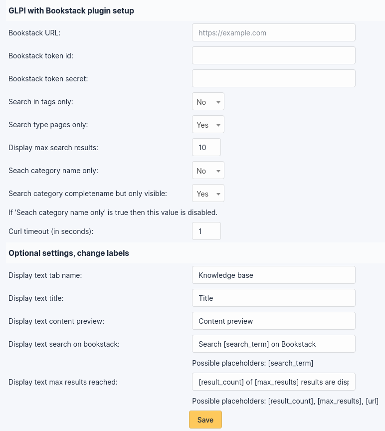

# GLPIwithBookstack GLPI plugin

Bookstack is a lovely tool for knowledge management.
It presents the data like a library.
I prefer Bookstack over the build in GLPI knowledge base so I try to integrate Bookstack's API into GLPI frontend.

Integration overview:
- Whenever your users create or edit a ticket they get the search results from your own Bookstack instance. You do not need to add any tags or links in GLPI or Bookstack. It will just use the full text search of Bookstack. You just need to set your categories wisely so they allow a precise search on Bookstack.
- New ticket form (self service frontend only): added Bookstack search results for the current selected category and it's subcategories: 
- Existing ticket form  (frontend and backend): added tab a new tab with customizable name. If you click on it the Bookstack results for the tickets category and it's subcategories will be displayed:  

When you install and enable the plugin a config symbol will be displayed next to the plugin entry in the settings:

Before you can use the Bookstack integration you need to set the url, api id and api secret.
The id and secret can be generated in the user settings in Bookstack.
There are a few settings you can set to customize your integration. Feel free to change them:

## Contributing

* Open a ticket for each bug/feature so it can be discussed
* Follow [development guidelines](http://glpi-developer-documentation.readthedocs.io/en/latest/plugins/index.html)
* Refer to [GitFlow](http://git-flow.readthedocs.io/) process for branching
* Work on a new branch on your own fork
* Open a PR that will be reviewed by a developer
